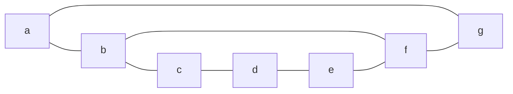
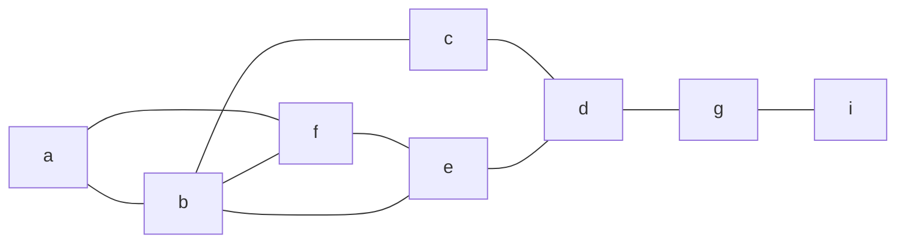
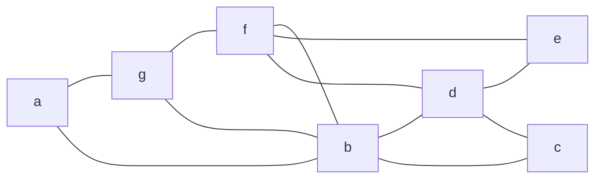
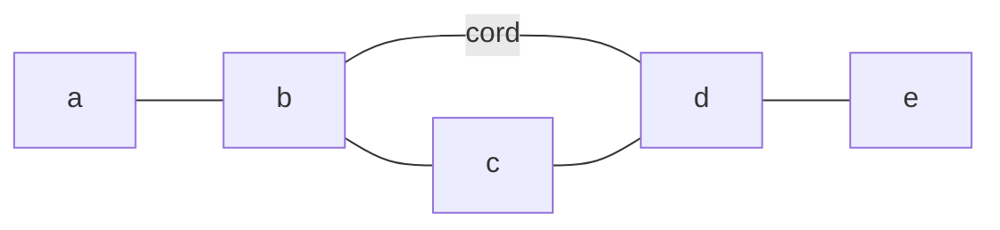
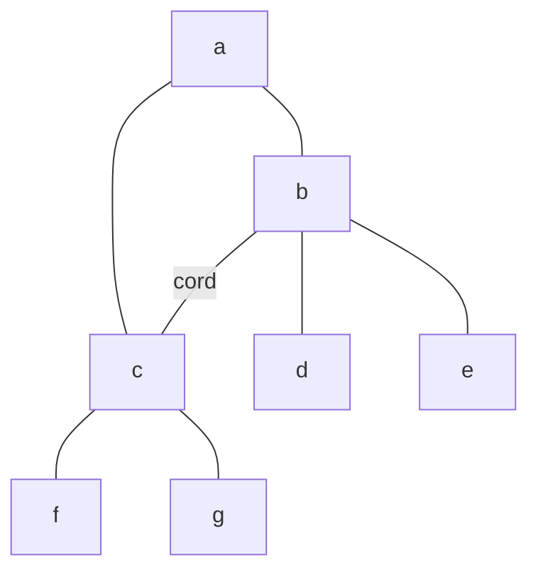
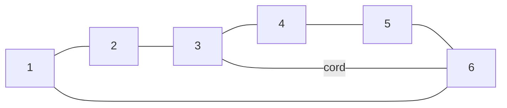

## Covered
- [[Deletion]]


- Connectivity property
	- Ex if we have a communication network and we want to destroy it. 
		- for the minimum cost we need to find the edges that connect the most number of vertices

[[Cut-Vertex]]
(point of articulation) point wehre deleting will destroy graph being connected.
here: vertex `D`

[[Cut-Edge]] 
(bridge) edge that if deleted will disconnect the graph, 
here: edge `{d,g}`

Connectivity of a graph, how strongly a graph is connected. 
- vertex connectivity(connectivity)
	- minimum number of vertices needing to be deleted to disconnect the graph.
	- k-connected graph, number need to be deleted is `k`
		- above is a 1-connected graph.
		- above 2 is 2-connected
	- `K` is used for connectivity
		- `K=1`
		- `K=2`
- Edge connectivity (edge connected)
	- number of edges needing to be deleted to destroy the graph
		- above is 1-edge-connected
		- above 2 is 2-edge-connected
	- `K'` is used for edge connectivity
		- `K'=1`
		- `K'=2`
- $K' \le \delta (G)$
	- `K'` is less than the min degree of `G`

### Exercises?
#### 1.1.2q2
Prove that for any graph `G` of order 2, the degree($\delta$) sequence has at least one pair of repeated elements
	So basically for any graph there are at least 1 pair of vertices with the same degree

In a graph with two vertices of an odd degree, those vertices must have a path between them.
#### 1.1.2q15a
`G=(V,E)` and $\delta(G) \le k$
	prove G has a path of  length at least k 
		will have at least k vertices




Cycle of `(a,b,f,g,a)` is a [[Simple Cycle]]
Cycle of `(g,f,e,d,f,b,g)`
has repeated so it is a [[Circuit]]


if $\delta(G) \ge k \ge 2$ Then `G` has a [[Cycle]] of length `k+1`
Every 2 connected graph has a cycle

- [[Complete Graph]]
- [[Empty Graph]]
- [[Null Graph]]
- [[Complement Graph]] $\bar{G}$ or $G^c$ edges not in G
	- $K_n$ -Complete graph on G vertices
	- so $G^c = K_n - G$ 
- [[Regular Graph]] (k-regular) vertices all have same degree
- [[Bipartite Graph]]
	- $K_{n,m}$ 
![[bipartyay]]
Cycle $C_n$
Path $P_n$
INDUCED MEANS NO CORD IN THING
Cycle is induced if no cord

length(P) = 4
<u>not induced</u>
Types:
- Tree
- Path
- Cycle
- Star
 other edges outside of this are called cords
 STAR:
 ```mermaid
 graph LR;
 a---b;
 a---c;
 a---d;
 a---e;
 a---f;
```
Tree

Cycle:


### Exercises
$$ G=(V,E),\ n\ge 1 $$
Max number of edges G can have
$$ \frac{n(n-1)}{2} $$
If bipartate graph is regular then m=n

$$ K_{4,4}$$
Does is contain k4 as a subgraph
no cause one side is not connected to itself so cannot have a complete graph

Bipartate has max k_x of x = 2

$k_{m,n}$ has no odd cycles
Cause you have to hit both sides at tleas once

A graph `G` is a bipartate graph iff it ahs no odd cycles
