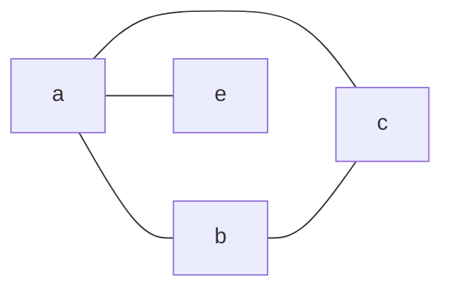

The number of [[Edge|edges]] containing a [[vertex]].

### Example

| Vertex | Degree |
| ---- | ---- |
| a | 3 |
| b | 2 |
| c | 2 |
| e | 1 |
## Maximum Degree
Denoted by $\Delta(G)$ is the largest degree in a [[Graph]]
`a` for the above example

## Minimum Degree
Denoted by $\delta(G)$ is the largest degree in a [[Graph]]
`e` for the above example

## Degree Sequence
Just a list of all the [[Vertex|vertices]] degree's in a [[graph]] in decreasing value
`{3,2,2,1}` for the above graph