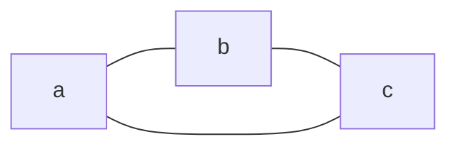
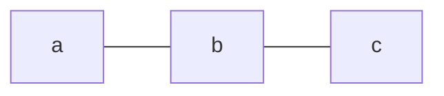
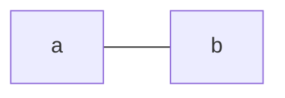

When deleting elements from a [[Graph]] what happens differs depending on if an [[Edge]] or a [[Vertex]] is deleted.

## Edge
If an [[Edge]] of a [[Graph]] is deleted, only that [[Edge]] is deleted.

If we delete the edge `{a,c}`, then that is the only thing removed from the graph.

## Vertex
If a [[Vertex]] is deleted then all the related [[Edge|edges]] are also deleted.

If we delete node `C` then both edges are also deleted:

