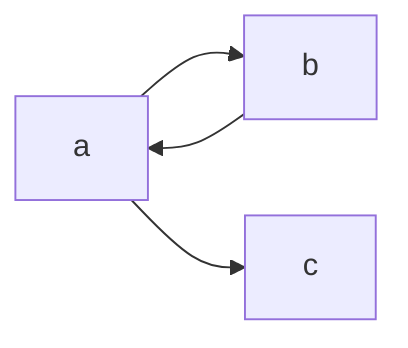

#graph
A [[Graph]] that had directed [[Edge|edges]], all other elements similar. 

The difference between the two is that the [[Edge]] set becomes a set of ordered pairs. The first [[Vertex]] in the pair is the origin and the second the destination. 

### Example
For the following:
`V = {a,b,c}`
`E = {{a,b}, {a,c}, {b,a}}`
Resulting graph is:

