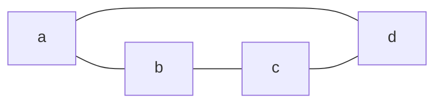

A data structure consisting of two finite sets `V` and `E`. 
- `V` is the set of [[Vertex|vertices]]
- `E` is the set of [[Edge|edges]]
Example graph from the book:
![[Pasted image 20240125093824.png]]

Example graph from code block:

## Graph Types
Couple different types of graphs were mentioned in class.
- [[Undirected Graph]]
- [[Directed Graph]]
- [[Multigraph]]
- [[Pseudograph]]
- [[Hypergraph]]
- [[Infinite Graph]]
- 