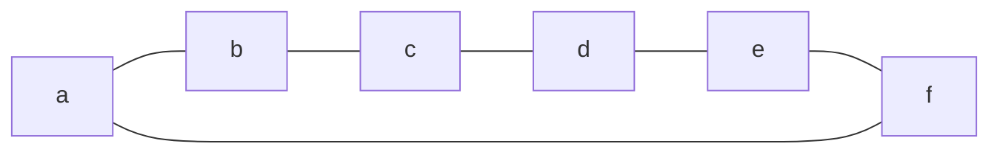

A set of [[Vertex|vertices]] are independent if all of the vertices in that set are not [[Adjacency|adjacent]] 

## Example

Here there are two independent sets:
`{a,c,e}`
and
`{b,d,f}`
Since none of the elements are [[Adjacency|adjacent]] to each other.