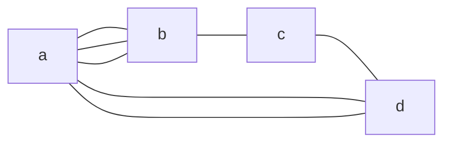

#graph
This type of [[Graph]] allows repeated elements in the [[Edge]] set(or the [[Edge]] set is a [[multiset]]).

## Example
For elements:
`V = {a,b,c,d}`
`E = {{a,b},{a,b},{a,b},{b,c},{c,d},{a,d},{a,d}}`

