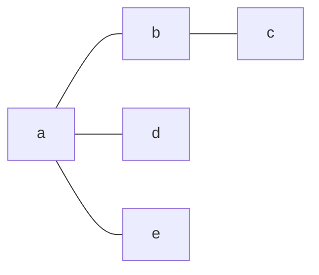

A set of [[Vertex|vertices]] [[Adjacency|adjacent]] to another [[Vertex]]

## Open Neighborhood
Neighborhood not including the original vertex.
Denoted by parenthesis N(v)

### Example

The `N(a)` is `{b,d,e}`

## Closed Neighborhood
Neighborhood including the original vertex
Denoted by brackets N\[v\]

### Example

The `N[a]` is `{a,b,d,e}`