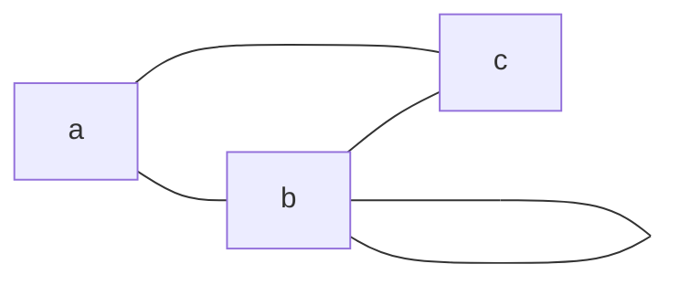

#graph
A [[Graph]] that allows [[Edge|edges]] to have the same source and destination [[Vertex]].

## Example
For elements:
`V = {a,b,c}`
`E = {{a,b}, {a,c}, {b,c}, {b,b}}`

```mermaid
graph LR;
a --- b;
a --- c;
b --- c;
b --- b;
```
